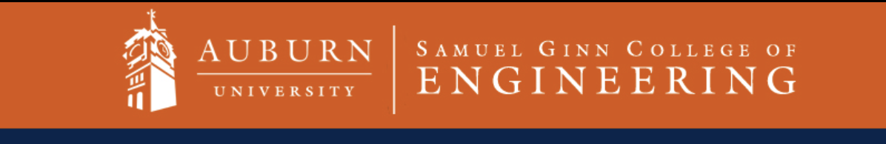

## COMP 2210
This course was an introduction to data structures and algorithms. In this course we learned various basic data structurues, basic algorithm analysis and the important relationship between pairing the right data structures with algorithms. This course was really fun, it taught me a lot about how to be a better programmer.

The official course description is below:

*Software development in the context of collections (e.g., lists, trees, graphs, hashtables). Communication, teamwork, and a design experience are integral course experience.*

There were seven modules (about two book chapters per module) to this course. Out of the 7, 6 had hands-on projects associated with them. The modules are as follows:

   1. Programming fundamentals

      * Generics
      * Testing
      * Total Order
      * Iterators

  2. Efficiency, Sorting, Divide & Conquer, and Recursion

     * Efficiency, Empirical analysis, Mathematical Analysis, Big O
     * Sorting (Including Divide and Conquer)
     * Recursion

  3. Collections, Bags, Array-based and Node-based Implementations

  4. Lists, Stacks, and Queues

     * Array Based Implementations
     * Node Based Implementations

  5. Search Trees and Binary Heaps

     * Binary Search Trees
     * AVL Trees
     * Red-Black Trees
     * Binary Heaps

 6. Hash Tables and Graphs

 7. Disjoint Sets
